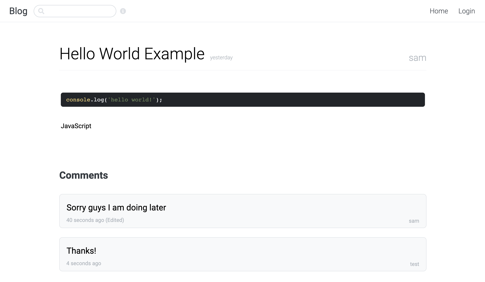

# React + Express + GraphQL Blog

## Features

-   [x] JWT authentication
-   [x] Login
-   [x] Create account
-   [x] See Profile
-   [x] Add post to favourites
-   [x] List posts
-   [x] See post
-   [x] Create post
-   [x] Edit post
-   [x] Delete post
-   [x] Search posts by title, content or username
    -   `title:keyword` (default)
    -   `content:keyword`
    -   `user:username`
-   [x] See comments
-   [x] Create comment
-   [x] Edit comment
-   [x] Delete comment

## Screenshots

    

